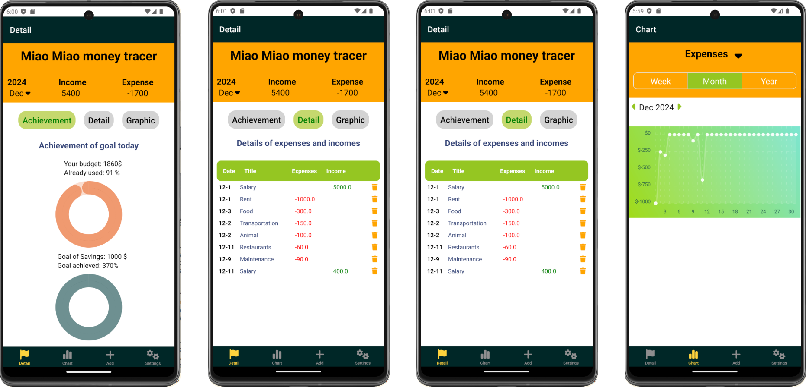
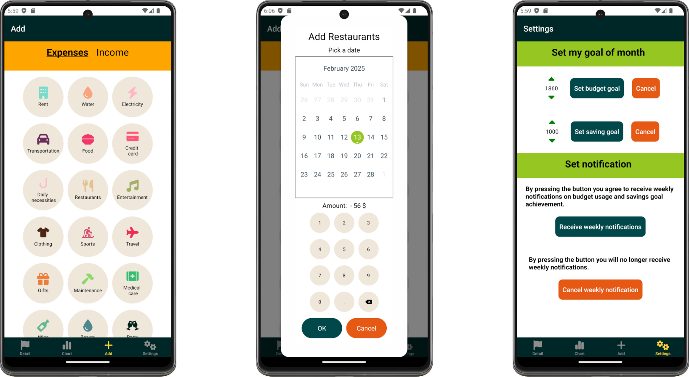

# Personal Budget Management App (mobile):
Developed a mobile app to track expenses, savings goals, and total balances, with data visualized using interactive charts.

## Technologies ##
React Native · TypeScript · SQLite

1. Explored and integrated charting libraries for dynamic data representation.

2. Implemented local data storage using Expo SQLite to save and manage user data securely on the device.

## Link on YouTube ## 
https://www.youtube.com/shorts/Ay6YnTXvkk0

## Screenshots ##

